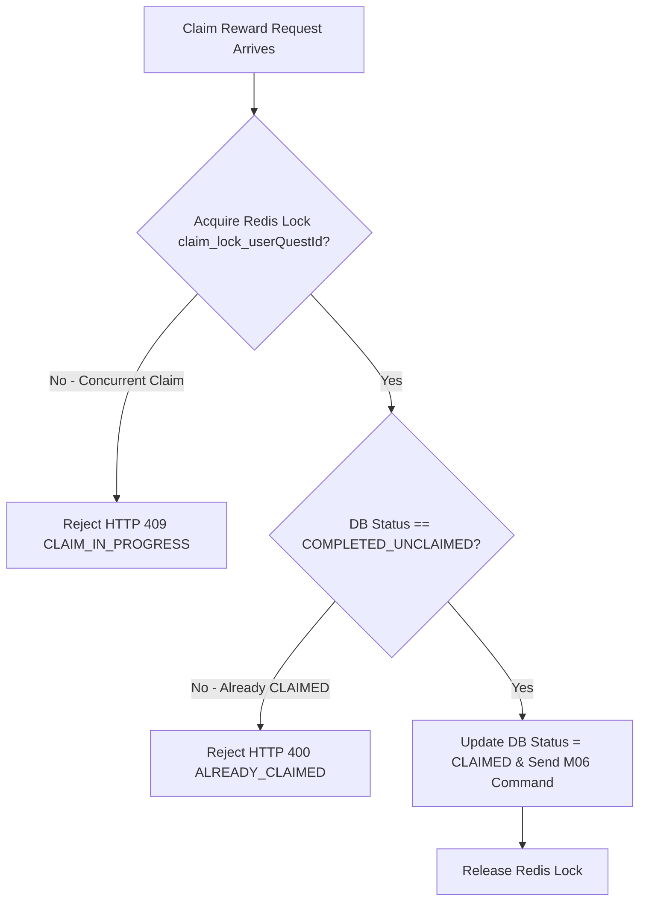

# Đảm bảo nhận thưởng đúng một lần M07

| Thuộc tính | Giá trị |
|---|---|
| Contract ID | `M07-QUEST-SINGLE-CLAIM-GUARANTEE-1.0` |
| Task | M07-T033 |
| Đầu vào | M07-REWARD-HANDOFF-M06-1.0 (M07-T032), M06-REWARD-IDEMPOTENCY-1.0 (M06-T016) |
| Phạm vi | Cơ chế khóa phân tán Redis Redlock (`Distributed Claim Lock`) đảm bảo mỗi nhiệm vụ ngày CHỈ ĐƯỢC CẤP THƯỞNG DUY NHẤT 1 LẦN dù người dùng bấm lặp dồn dập trên nhiều thiết bị |
| Tự kiểm | B-G04 |
| Phiên bản | 1.0 — 2026-08-22 |

## 1. Mục tiêu và invariant

Tài liệu này chuẩn hóa cơ chế chống nhận thưởng trùng lặp (`Single Claim Idempotency Engine`) trong M07.

- **Khóa Phân tán Chống Nhấn Lặp / Đa Thiết bị (`Distributed Claim Lock Invariant`)**:
  - Khi tiếp nhận `ClaimRewardRequest`:
    - M07 BẮT BUỘC tạo khóa phân tán Redis `claim_lock_{userQuestId}` với TTL = 30 giây.
    - 100% request trùng `userQuestId` đến sau trong khi lock đang mở BẮT BUỘC bị từ chối ngay với HTTP 409 `CLAIM_IN_PROGRESS`.
- **Cập nhật Trạng thái Atomically trong DB (`Atomic State Transition Rule`)**:
  - Trạng thái `UserQuest` BẮT BUỘC đổi từ `COMPLETED_UNCLAIMED` sang `CLAIMED` ngay trong cùng DB Transaction với việc phát `GrantQuestRewardCommand`.

## 2. Luồng Khóa Chống Nhận Thưởng Trùng (Single Claim Flow)

## 3. Regression Gates và Test Cases

### 3.1. Regression Gates
- `SC-G01`: 100% request bấm nhận thưởng đồng thời từ 2 thiết bị chỉ có đúng 1 request được xử lý thành công.
- `SC-G02`: Nhiệm vụ chuyển trạng thái `CLAIMED` từ chối $100\%$ các lệnh nhận thưởng tiếp theo.

### 3.2. Test Cases tự kiểm
| Case ID | Tình huống | Kết quả bắt buộc |
|---|---|---|
| `SC33-01` | Learner bấm nút "Nhận thưởng" 5 lần trong 1 giây do lag mạng | Lock Redis chặn 4 request đến sau, chỉ 1 request đầu tiên được cấp thưởng thành công. |
| `SC33-02` | Learner A bấm nhận thưởng trên iPhone và iPad cùng lúc 12:00:00.000 | Đúng 1 thiết bị nhận thông báo "Nhận thưởng thành công", thiết bị kia báo "Đã nhận thưởng". |
| `SC33-03` | Kiểm thử hoàn tất luồng M07-QUEST-SINGLE-CLAIM-GUARANTEE-1.0 | Đạt 100% tiêu chí nghiệm thu |

## 4. Đối chiếu Hiện trạng và Finding

| Finding ID | Quan sát | Sai lệch | Task tiếp nhận |
|---|---|---|---|
| `M07-SC-F01` | Tích hợp Redlock.net trong `ClaimRewardCommandHandler` | Đảm bảo tính toàn vẹn khi nhận thưởng đa thiết bị | M07-T032 |

## 5. Tự kiểm M07-T033
- Đã hoàn thành đặc tả `M07-QUEST-SINGLE-CLAIM-GUARANTEE-1.0`.
- Chốt cơ chế Redis Redlock TTL 30s và chuyển trạng thái atomic sang CLAIMED.
- Ghi nhận 2 Regression Gates (`SC-G01`–`SC-G02`) và 3 Test Cases (`SC33-01`–`SC33-03`).

## 6. Lịch sử
| Ngày | Phiên bản | Thay đổi | Người tự kiểm |
|---|---|---|---|
| 2026-08-22 | 1.0 | Tạo mới đặc tả đảm bảo nhận thưởng đúng một lần M07-T033 | WSA-7K2 |
