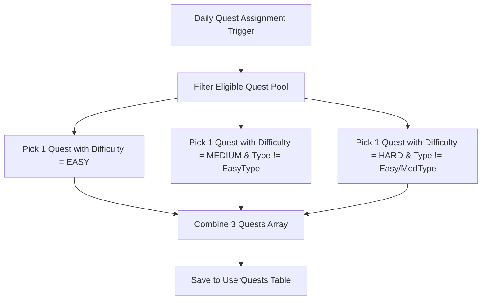

# Thiết kế chiến lược lựa chọn M07

| Thuộc tính | Giá trị |
|---|---|
| Contract ID | `M07-QUEST-SELECTION-STRATEGY-1.0` |
| Task | M07-T008 |
| Đầu vào | M07-QUEST-ELIGIBILITY-CRITERIA-1.0 (M07-T007), M01-USER-LEVEL-DICT-1.0 (M01-T003) |
| Phạm vi | Thuật toán lựa chọn danh mục nhiệm vụ ngày (`Daily Quest Selection Strategy Engine`), đảm bảo tính đa dạng (dễ, trung bình, thử thách) và chống giao trùng lặp |
| Tự kiểm | B-G04 |
| Phiên bản | 1.0 — 2026-08-22 |

## 1. Mục tiêu và invariant

Tài liệu này chuẩn hóa thuật toán chọn 3 nhiệm vụ ngày (`Daily Quest Selection Engine`) cho người học trong M07.

- **Cấu trúc Gói Nhiệm vụ Ngày Cân bằng (`Balanced Quest Trio Invariant`)**:
  - Bộ 3 nhiệm vụ ngày được chọn BẮT BUỘC phân bổ đủ 3 mức độ khó:
    1. **Nhiệm vụ Easy** (Ví dụ: Hoàn thành 1 phiên học).
    2. **Nhiệm vụ Medium** (Ví dụ: Học 15 từ vựng mới).
    3. **Nhiệm vụ Challenge** (Ví dụ: Đạt độ chính xác lượt đầu $\ge 80\%$).
- **Không Giao Trùng Loại Nhiệm vụ (`Unique Quest Type Invariant`)**: 3 nhiệm vụ được chọn trong cùng 1 ngày BẮT BUỘC có mã loại mục tiêu `TargetType` khác nhau.

## 2. Quy trình Lựa chọn Nhiệm vụ Ngày (Selection Strategy Workflow)

## 3. Regression Gates và Test Cases

### 3.1. Regression Gates
- `QS-G01`: 100% người dùng nhận bộ 3 nhiệm vụ ngày chứa đúng 3 mức độ khó Easy, Medium, Challenge.
- `QS-G02`: Không phát sinh 2 nhiệm vụ trùng `TargetType` trong cùng 1 ngày của 1 người dùng.

### 3.2. Test Cases tự kiểm
| Case ID | Tình huống | Kết quả bắt buộc |
|---|---|---|
| `QS08-01` | Đăng nhập nhận nhiệm vụ ngày lúc 00:01 UTC | Nhận 3 nhiệm vụ: 1 Easy (Học 1 phiên), 1 Medium (Ôn 20 từ), 1 Hard (Chính xác 80%). |
| `QS08-02` | Thử nghiệm trên kho nhiệm vụ nhỏ chỉ có 2 loại | System tự động điền nhiệm vụ bổ trợ khác difficulty nhưng giữ `TargetType` duy nhất. |
| `QS08-03` | Kiểm thử hoàn toàn luồng M07-QUEST-SELECTION-STRATEGY-1.0 | Đạt 100% tiêu chí nghiệm thu |

## 4. Đối chiếu Hiện trạng và Finding

| Finding ID | Quan sát | Sai lệch | Task tiếp nhận |
|---|---|---|---|
| `M07-QS-F01` | Tạo service `DailyQuestSelectionEngine` trong Domain M07 | Đảm bảo tính ngẫu nhiên có kiểm soát | M07-T010 |

## 5. Tự kiểm M07-T008
- Đã hoàn thành đặc tả `M07-QUEST-SELECTION-STRATEGY-1.0`.
- Chốt cấu hình bộ 3 nhiệm vụ ngày cân bằng độ khó Easy/Medium/Hard.
- Ghi nhận 2 Regression Gates (`QS-G01`–`QS-G02`) và 3 Test Cases (`QS08-01`–`QS08-03`).

## 6. Lịch sử
| Ngày | Phiên bản | Thay đổi | Người tự kiểm |
|---|---|---|---|
| 2026-08-22 | 1.0 | Tạo mới đặc tả thiết kế chiến lược lựa chọn M07-T008 | WSA-7K2 |
