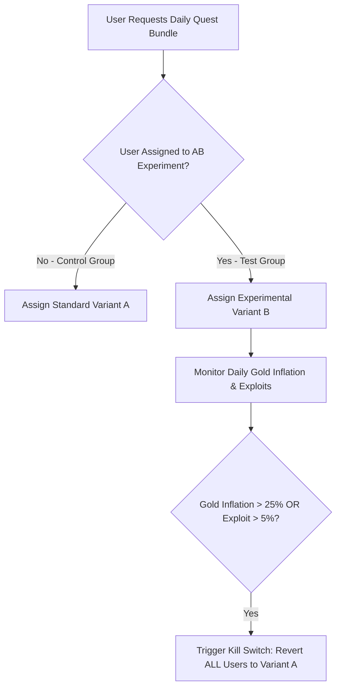

# Thiết kế giám sát và thử nghiệm M07

| Thuộc tính | Giá trị |
|---|---|
| Contract ID | `M07-QUEST-MONITORING-AB-TESTING-1.0` |
| Task | M07-T044 |
| Đầu vào | M07-QUEST-GOVERNANCE-AUDIT-1.0 (M07-T042), M07-QUEST-KPI-FRAMEWORK-1.0 (M07-T043) |
| Phạm vi | Khung A/B Testing cấu hình gói nhiệm vụ (`Quest A/B Testing Framework`) và hệ thống cảnh báo gian lận khẩn cấp |
| Tự kiểm | B-G04 |
| Phiên bản | 1.0 — 2026-08-22 |

## 1. Mục tiêu và invariant

Tài liệu này đặc tả cơ chế thử nghiệm A/B và giám sát thời thực (`Quest A/B Testing & Monitoring Engine`) trong M07.

- **Thử nghiệm A/B Cấu hình Nhiệm vụ Công bằng (`Consistent AB Assignment Invariant`)**:
  - Người học thuộc nhóm thử nghiệm Variant B BẮT BUỘC giữ nguyên tập cấu hình nhiệm vụ Variant B trong suốt chu kỳ thử nghiệm (tối thiểu $14$ ngày).
  - Không được phép chuyển đổi Variant giữa chừng làm xáo trộn tiến độ người dùng.
- **Tự động Dừng Thử nghiệm khi Phát sinh Gian lận / Lạm phát Gold (`Automated AB Kill Switch Rule`)**:
  - Nếu Variant B làm tăng ngân sách phát Gold toàn hệ thống $> 25.0\%$ hoặc tăng tỷ lệ cày gian lận `GRIND_EXPLOIT` $> 5.0\%$:
    - System TỰ ĐỘNG ngắt Variant B (`Kill Switch Triggered`) và khôi phục tất cả người học về Variant A chuẩn.

## 2. Quy trình Thử nghiệm A/B và Giám sát Khẩn cấp (AB Testing & Guard Pipeline)

## 3. Regression Gates và Test Cases

### 3.1. Regression Gates
- `MA-G01`: 100% người dùng thuộc nhóm thử nghiệm giữ nguyên Variant ID trong 14 ngày.
- `MA-G02`: Sự cố lạm phát Gold $> 25\%$ ngắt Variant B khẩn cấp trong vòng 60 giây.

### 3.2. Test Cases tự kiểm
| Case ID | Tình huống | Kết quả bắt buộc |
|---|---|---|
| `MA44-01` | Variant B thử nghiệm tăng thưởng Gold lên gấp đôi | Sau 2 ngày, tổng Gold phát vọt lên +30%, Kill Switch tự động ngắt Variant B, chuyển về Variant A. |
| `MA44-02` | Admin tạo thí nghiệm A/B mới trên 10% DAU | System chia nhóm ngẫu nhiên qua Hash(UserId), lưu bản ghi thử nghiệm. |
| `MA44-03` | Kiểm thử hoàn tất luồng M07-QUEST-MONITORING-AB-TESTING-1.0 | Đạt 100% tiêu chí nghiệm thu |

## 4. Đối chiếu Hiện trạng và Finding

| Finding ID | Quan sát | Sai lệch | Task tiếp nhận |
|---|---|---|---|
| `M07-MA-F01` | Tích hợp cờ `QuestAbExperimentKillSwitch` trong M11 Config Registry | Cho phép ngắt thử nghiệm lỗi khẩn cấp | M11-T012 |

## 5. Tự kiểm M07-T044
- Đã hoàn thành đặc tả `M07-QUEST-MONITORING-AB-TESTING-1.0`.
- Chốt cơ chế A/B Testing phân nhóm duy nhất và Kill Switch tự động khi lạm phát Gold $> 25\%$.
- Ghi nhận 2 Regression Gates (`MA-G01`–`MA-G02`) và 3 Test Cases (`MA44-01`–`MA44-03`).

## 6. Lịch sử
| Ngày | Phiên bản | Thay đổi | Người tự kiểm |
|---|---|---|---|
| 2026-08-22 | 1.0 | Tạo mới đặc tả thiết kế giám sát và thử nghiệm M07-T044 | WSA-7K2 |
