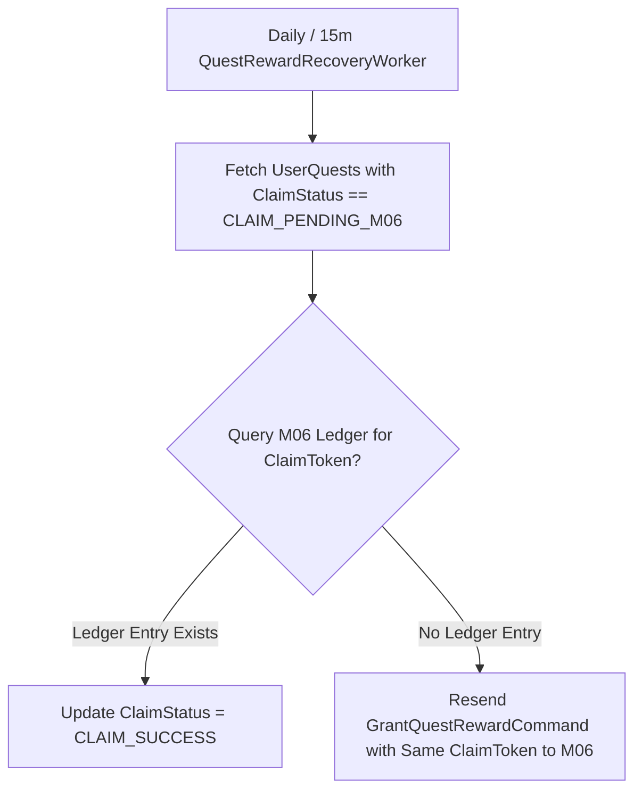

# Thiết kế phục hồi và đối soát thưởng M07

| Thuộc tính | Giá trị |
|---|---|
| Contract ID | `M07-QUEST-REWARD-RECOVERY-RECONCILIATION-1.0` |
| Task | M07-T034 |
| Đầu vào | M07-REWARD-HANDOFF-M06-1.0 (M07-T032), M07-QUEST-SINGLE-CLAIM-GUARANTEE-1.0 (M07-T033) |
| Phạm vi | Tiến trình ngầm đối soát và phát lại lệnh nhận thưởng bị kẹt (`Reward Claim Reconciliation Worker`), bảo đảm người học KHÔNG MẤT PHẦN THƯỞNG do sự cố gián đoạn mạng giữa M07 và M06 |
| Tự kiểm | B-G04 |
| Phiên bản | 1.0 — 2026-08-22 |

## 1. Mục tiêu và invariant

Tài liệu này chuẩn hóa quy trình tự động phục hồi và đối soát phần thưởng (`Quest Reward Recovery & Reconciliation Engine`) trong M07.

- **Đảm bảo Người học Không Mất Quyền Nhận Thưởng (`No Lost Reward Invariant`)**:
  - Nếu lệnh phát thưởng `GrantQuestRewardCommand` gửi sang M06 bị rớt (ví dụ: M06 sập dịch vụ tạm thời):
    - Trạng thái `UserQuest` BẮT BUỘC lưu `ClaimStatus = CLAIM_PENDING_M06`.
    - Worker `QuestRewardRecoveryWorker` chạy 15 phút/lần BẮT BUỘC tự động retry gửi lại lệnh sang M06 cho đến khi M06 xác nhận `CLAIM_SUCCESS`.
- **Đối soát Số lượng Nhận thưởng Khớp 100% với Sổ cái M06 (`M07-M06 Claim Audit Invariant`)**: Tổng số bản ghi `CLAIMED` trong M07 BẮT BUỘC khớp $100\%$ với số dòng sổ cái `CREDIT_QUEST_REWARD` trong M06.

## 2. Luồng Phục hồi Lệnh Nhận Thưởng bị Kẹt (Reward Recovery Flow)

## 3. Regression Gates và Test Cases

### 3.1. Regression Gates
- `RR-G01`: 100% bản ghi `UserQuest` trạng thái `CLAIM_PENDING_M06` được Worker retry thành công khi M06 khôi phục kết nối.
- `RR-G02`: Sự cố gửi lại lệnh không sinh ra thêm bất kỳ dòng sổ cái trùng lặp nào trong M06.

### 3.2. Test Cases tự kiểm
| Case ID | Tình huống | Kết quả bắt buộc |
|---|---|---|
| `RR34-01` | M06 bị đứt kết nối DB đúng lúc Learner bấm nhận thưởng | Trạng thái ghi `CLAIM_PENDING_M06`. 15 phút sau M06 hoạt động lại, Worker retry thành công, người dùng nhận đủ 100 Gold. |
| `RR34-02` | Admin chạy lệnh đối soát 24h giữa M07 và M06 | Báo cáo chốt "Khớp 100%, 0 chênh lệch". |
| `RR34-03` | Kiểm thử hoàn tất luồng M07-QUEST-REWARD-RECOVERY-RECONCILIATION-1.0 | Đạt 100% tiêu chí nghiệm thu |

## 4. Đối chiếu Hiện trạng và Finding

| Finding ID | Quan sát | Sai lệch | Task tiếp nhận |
|---|---|---|---|
| `M07-RR-F01` | Đăng ký Cron Job `QuestRewardRecoveryWorker` trong M07 Service | Phục vụ tự động đối soát và phát lại lệnh nhận thưởng | M07-T032 |

## 5. Tự kiểm M07-T034
- Đã hoàn thành đặc tả `M07-QUEST-REWARD-RECOVERY-RECONCILIATION-1.0`.
- Chốt trạng thái `CLAIM_PENDING_M06` và tiến trình ngầm retry tự động khôi phục quyền lợi.
- Ghi nhận 2 Regression Gates (`RR-G01`–`RR-G02`) và 3 Test Cases (`RR34-01`–`RR34-03`).

## 6. Lịch sử
| Ngày | Phiên bản | Thay đổi | Người tự kiểm |
|---|---|---|---|
| 2026-08-22 | 1.0 | Tạo mới đặc tả thiết kế phục hồi và đối soát thưởng M07-T034 | WSA-7K2 |
