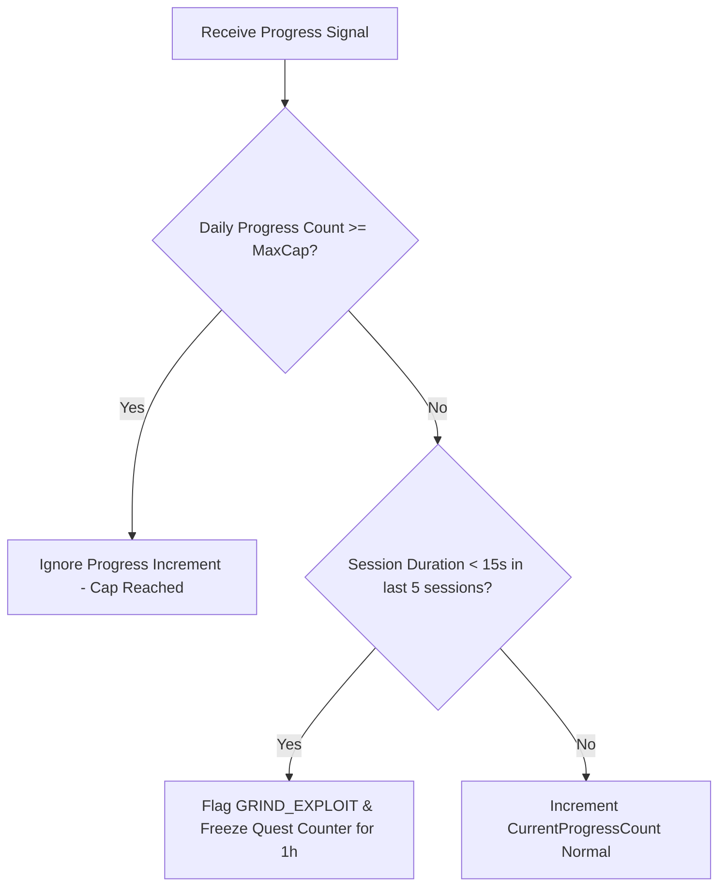

# Thiết kế trần và chống cày M07

| Thuộc tính | Giá trị |
|---|---|
| Contract ID | `M07-ANTI-GRIND-CEILING-POLICY-1.0` |
| Task | M07-T021 |
| Đầu vào | M07-NEW-LEARNING-UNIT-SPEC-1.0 (M07-T017), M07-REVIEW-UNIT-SPEC-1.0 (M07-T018), M07-QUALITY-TARGET-SPEC-1.0 (M07-T019), M07-PRONUNCIATION-PVP-QUEST-SPEC-1.0 (M07-T020) |
| Phạm vi | Quy tắc đặt trần tối đa (`Anti-Grind Daily Cap Ceiling`) và cơ chế chống cày điểm nhiệm vụ bất thường (spam bot/cheat), bảo vệ sức khỏe học tập của người học |
| Tự kiểm | B-G04 |
| Phiên bản | 1.0 — 2026-08-22 |

## 1. Mục tiêu và invariant

Tài liệu này chuẩn hóa chính sách trần và chống cày (`Anti-Grind & Daily Ceiling Policy`) trong M07.

- **Trần Tối đa Đếm Tiến độ Nhiệm vụ Ngày (`Daily Progress Cap Invariant`)**:
  - Mỗi chỉ số tiến độ nhiệm vụ ngày (ví dụ: số phiên học, số từ vựng) BẮT BUỘC kẹp trần tối đa ghi nhận tiến độ trong 1 ngày nghiệp vụ:
    - *Số phiên học ghi nhận tiến độ*: Tối đa $10$ phiên/ngày.
    - *Số từ vựng ghi nhận tiến độ*: Tối đa $100$ từ/ngày.
  - Mọi hoạt động vượt quá trần này vẫn lưu vết lịch sử học tập M04 nhưng KHÔNG ĐƯỢC CỘNG TIẾN ĐỘ vào M07.
- **Tự động Khóa Tiến độ khi Phát hiện Cày dồn dập (`Exploit Rate Limiting Rule`)**: Thực hiện 5 phiên học trong thời gian $< 3$ phút tự động tạm dừng đếm tiến độ nhiệm vụ trong 1 giờ.

## 2. Quy trình Kiểm tra Trần và Chống cày Tiến độ (Anti-Grind Workflow)

## 3. Regression Gates và Test Cases

### 3.1. Regression Gates
- `AG-G01`: 100% tiến độ nhiệm vụ vượt quá 100 từ/ngày bị dừng cộng điểm trong M07.
- `AG-G02`: Hành vi cày 5 phiên siêu ngắn trong 3 phút bị gắn cờ `GRIND_EXPLOIT` và tạm dừng 1 giờ.

### 3.2. Test Cases tự kiểm
| Case ID | Tình huống | Kết quả bắt buộc |
|---|---|---|
| `AG21-01` | Learner hoàn thành phiên học thứ 11 trong ngày | M04 ghi nhận lịch sử bình thường. M07 không cộng thêm tiến độ nhiệm vụ ngày. |
| `AG21-02` | Learner cố tình hoàn thành 5 phiên trong 2 phút (chạy script) | System dán nhãn `GRIND_EXPLOIT`, đóng băng đếm tiến độ nhiệm vụ trong 60 phút. |
| `AG21-03` | Kiểm thử hoàn tất luồng M07-ANTI-GRIND-CEILING-POLICY-1.0 | Đạt 100% tiêu chí nghiệm thu |

## 4. Đối chiếu Hiện trạng và Finding

| Finding ID | Quan sát | Sai lệch | Task tiếp nhận |
|---|---|---|---|
| `M07-AG-F01` | Tạo Redis Key `grind_lock_{userId}` để tạm dừng đếm tiến độ 60 phút | Đảm bảo tính minh bạch và sức khỏe người học | M07-T012 |

## 5. Tự kiểm M07-T021
- Đã hoàn thành đặc tả `M07-ANTI-GRIND-CEILING-POLICY-1.0`.
- Chốt trần ngày (10 phiên / 100 từ) và cờ `GRIND_EXPLOIT` đóng băng 1 giờ.
- Ghi nhận 2 Regression Gates (`AG-G01`–`AG-G02`) và 3 Test Cases (`AG21-01`–`AG21-03`).

## 6. Lịch sử
| Ngày | Phiên bản | Thay đổi | Người tự kiểm |
|---|---|---|---|
| 2026-08-22 | 1.0 | Tạo mới đặc tả thiết kế trần và chống cày M07-T021 | WSA-7K2 |
