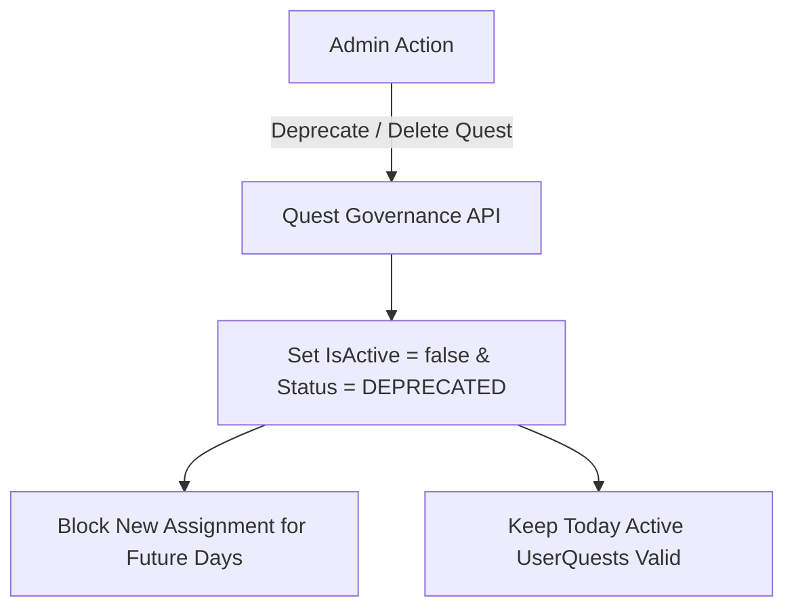

# Xử lý ngừng dùng và xóa nhiệm vụ M07

| Thuộc tính | Giá trị |
|---|---|
| Contract ID | `M07-DEPRECATE-DELETE-QUEST-1.0` |
| Task | M07-T006 |
| Đầu vào | M07-QUEST-CHANGE-LIFECYCLE-1.0 (M07-T004), M07-QUEST-SNAPSHOT-VERSIONING-1.0 (M07-T005) |
| Phạm vi | Quy trình ngừng sử dụng (`DEPRECATED`) hoặc xóa nhiệm vụ (`Delete Quest`), bảo vệ quyền lợi nhận thưởng của các nhiệm vụ đã phân bổ trước đó |
| Tự kiểm | B-G04 |
| Phiên bản | 1.0 — 2026-08-22 |

## 1. Mục tiêu và invariant

Tài liệu này quy định ứng xử hệ thống khi một định nghĩa nhiệm vụ bị Admin ngừng sử dụng (`DEPRECATED`) hoặc xóa trong M07.

- **Bảo toàn Quyền lợi Nhiệm vụ Đã Phân bổ (`Assigned Quest Preservation Invariant`)**:
  - Khi Admin chuyển trạng thái định nghĩa nhiệm vụ sang `DEPRECATED` hoặc `DELETED`:
    - Nhiệm vụ đó KHÔNG ĐƯỢC PHÂN BỔ MỚI cho bất kỳ người dùng nào trong các chu kỳ ngày tiếp theo.
    - Các người dùng ĐÃ ĐƯỢC PHÂN BỔ nhiệm vụ đó trong chu kỳ ngày hôm nay VẪN ĐƯỢC PHÉP làm tiếp, hoàn thành và nhận thưởng bình thường.
- **Cấm Xóa Cứng Định nghĩa Đã Tham chiếu (`No Hard Delete Invariant`)**: CẤM xóa cứng (`DELETE`) các bản ghi `QuestDefinitions` đã từng được gán cho người dùng. Bắt buộc dùng Soft-delete `IsDeleted = true`.

## 2. Quy trình Ngừng dùng và Soft-Delete Nhiệm vụ (Deprecation Flow)

## 3. Regression Gates và Test Cases

### 3.1. Regression Gates
- `DD-G01`: 100% nhiệm vụ đã phân bổ cho người dùng trước thời điểm deprecate vẫn cho phép bấm nhận thưởng thành công.
- `DD-G02`: Không phát sinh lỗi SQL ForeignKey Exception do xóa cứng định nghĩa nhiệm vụ.

### 3.2. Test Cases tự kiểm
| Case ID | Tình huống | Kết quả bắt buộc |
|---|---|---|
| `DD06-01` | Admin bấm "Ngừng dùng" nhiệm vụ "Học 30 từ B1" lúc 10:00 AM | Người dùng A đã nhận nhiệm vụ này lúc 07:00 AM vẫn bấm nhận thưởng thành công lúc 11:00 AM. |
| `DD06-02` | Ngày tiếp theo (00:00 UTC) sinh nhiệm vụ ngày | Nhiệm vụ "Học 30 từ B1" không nằm trong danh mục chọn phân bổ. |
| `DD06-03` | Kiểm thử hoàn tất luồng M07-DEPRECATE-DELETE-QUEST-1.0 | Đạt 100% tiêu chí nghiệm thu |

## 4. Đối chiếu Hiện trạng và Finding

| Finding ID | Quan sát | Sai lệch | Task tiếp nhận |
|---|---|---|---|
| `M07-DD-F01` | Thêm thuộc tính `IsDeleted` vào Entity `QuestDefinition` | Phục vụ Soft-delete an toàn | M07-T003 |

## 5. Tự kiểm M07-T006
- Đã hoàn thành đặc tả `M07-DEPRECATE-DELETE-QUEST-1.0`.
- Chốt nguyên tắc bảo toàn quyền lợi nhiệm vụ đã phân bổ và Soft-delete 100%.
- Ghi nhận 2 Regression Gates (`DD-G01`–`DD-G02`) và 3 Test Cases (`DD06-01`–`DD06-03`).

## 6. Lịch sử
| Ngày | Phiên bản | Thay đổi | Người tự kiểm |
|---|---|---|---|
| 2026-08-22 | 1.0 | Tạo mới đặc tả xử lý ngừng dùng và xóa nhiệm vụ M07-T006 | WSA-7K2 |
