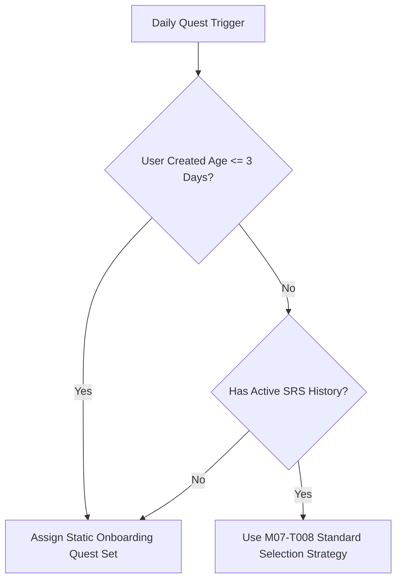

# Xử lý người dùng mới và dữ liệu thiếu M07

| Thuộc tính | Giá trị |
|---|---|
| Contract ID | `M07-NEW-USER-MISSING-DATA-HANDLING-1.0` |
| Task | M07-T009 |
| Đầu vào | M07-QUEST-ELIGIBILITY-CRITERIA-1.0 (M07-T007), M07-QUEST-SELECTION-STRATEGY-1.0 (M07-T008) |
| Phạm vi | Chiến lược phân bổ tập nhiệm vụ khởi đầu cho người dùng mới (`Onboarding Quest Bundle`) và xử lý tình huống thiếu dữ liệu lịch sử học tập |
| Tự kiểm | B-G04 |
| Phiên bản | 1.0 — 2026-08-22 |

## 1. Mục tiêu và invariant

Tài liệu này đặc tả quy trình gán nhiệm vụ ngày cho tài khoản người dùng mới tạo hoặc người dùng chưa có dữ liệu lịch sử học tập trong M07.

- **Tập Nhiệm vụ Khởi đầu Cố định (`Onboarding Quest Bundle Invariant`)**:
  - Người dùng mới khởi tạo (trong 3 ngày đầu tiên sau khi đăng ký) BẮT BUỘC nhận gói 3 nhiệm vụ nhập môn (`ONBOARDING_QUEST_SET`):
    1. Nhiệm vụ 1: Hoàn thành 1 bài học đầu tiên (Dễ).
    2. Nhiệm vụ 2: Học 5 từ vựng mới (Dễ).
    3. Nhiệm vụ 3: Đánh giá cảm nhận bài học (Dễ).
- **Cấm Giao Nhiệm vụ Yêu cầu Lịch sử SRS (`No SRS Dependency for New Users Rule`)**: Tuyệt đối CẤM phân bổ các nhiệm vụ ôn tập SRS (như "Ôn 20 từ đến hạn") cho người dùng mới chưa có từ vựng đến hạn trong M04.

## 2. Luồng Phân bổ Nhiệm vụ cho Người dùng Mới (New User Quest Assignment Flow)

## 3. Regression Gates và Test Cases

### 3.1. Regression Gates
- `NU-G01`: 100% người dùng mới tạo trong 3 ngày đầu nhận được đúng 3 nhiệm vụ nhập môn khởi đầu.
- `NU-G02`: Không có người dùng mới nào nhận được nhiệm vụ ôn tập SRS khi chưa có từ vựng trong M04.

### 3.2. Test Cases tự kiểm
| Case ID | Tình huống | Kết quả bắt buộc |
|---|---|---|
| `NU09-01` | Người dùng vừa đăng ký tài khoản xong lúc 10:00 AM | Nhận 3 nhiệm vụ nhập môn cơ bản (Học 1 bài, Học 5 từ, Cảm nhận). |
| `NU09-02` | Người dùng tạo tài khoản ngày thứ 2 mở app | Tiếp tục nhận tập nhiệm vụ nhập môn giai đoạn 2 phù hợp trình độ mới. |
| `NU09-03` | Kiểm thử hoàn tất luồng M07-NEW-USER-MISSING-DATA-HANDLING-1.0 | Đạt 100% tiêu chí nghiệm thu |

## 4. Đối chiếu Hiện trạng và Finding

| Finding ID | Quan sát | Sai lệch | Task tiếp nhận |
|---|---|---|---|
| `M07-NU-F01` | Khởi tạo cờ `IsOnboardingPhase = true` trong `UserProfile` M01 | Phục vụ nhận diện người dùng mới | M07-T007 |

## 5. Tự kiểm M07-T009
- Đã hoàn thành đặc tả `M07-NEW-USER-MISSING-DATA-HANDLING-1.0`.
- Chốt gói 3 nhiệm vụ nhập môn cho 3 ngày đầu và cấm giao nhiệm vụ SRS khi chưa có lịch sử.
- Ghi nhận 2 Regression Gates (`NU-G01`–`NU-G02`) và 3 Test Cases (`NU09-01`–`NU09-03`).

## 6. Lịch sử
| Ngày | Phiên bản | Thay đổi | Người tự kiểm |
|---|---|---|---|
| 2026-08-22 | 1.0 | Tạo mới đặc tả xử lý người dùng mới và dữ liệu thiếu M07-T009 | WSA-7K2 |
