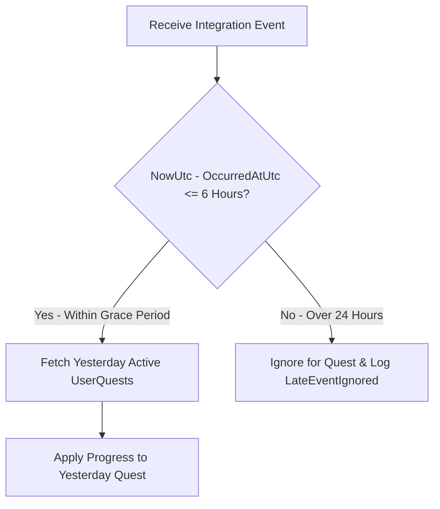

# Xử lý sự kiện đến muộn M07

| Thuộc tính | Giá trị |
|---|---|
| Contract ID | `M07-LATE-ARRIVING-EVENT-HANDLING-1.0` |
| Task | M07-T024 |
| Đầu vào | M07-QUEST-EVENT-CONTRACT-1.0 (M07-T012), M07-TIMEZONE-DAY-BOUNDARY-1.0 (M07-T022) |
| Phạm vi | Quy trình tiếp nhận và xử lý các sự kiện tín hiệu học tập đến muộn (`Late-Arriving Events`), ví dụ: người học bị mất mạng rạng sáng qua nửa đêm và đồng bộ lại vào ngày hôm sau |
| Tự kiểm | B-G04 |
| Phiên bản | 1.0 — 2026-08-22 |

## 1. Mục tiêu và invariant

Tài liệu này quy định chiến lược xử lý các sự kiện đến muộn (`Late-Arriving Events Strategy`) trong M07.

- **Quy tắc Quy đổi Thời điểm Xảy ra Thực tế (`OccurredAtUtc Cutoff Rule`)**:
  - Tiến độ nhiệm vụ BẮT BUỘC quy đổi theo thuộc tính `OccurredAtUtc` (thời điểm người học hoàn thành bài học thực tế trên thiết bị), không dựa theo `ReceivedAtUtc` (thời điểm server nhận được message).
- **Cửa sổ Chấp nhận Sự kiện Đến muộn (`Late Arrival Window Grace Period`)**:
  - Các sự kiện xảy ra trong ngày nghiệp vụ hôm qua nhưng đến muộn trong vòng $6$ giờ ($00:00 - 06:00$ ngày hôm sau) VẪN ĐƯỢC CỘNG CỦA NGÀY HÔM QUA nếu nhiệm vụ chưa chốt tổng kết.
  - Sự kiện đến quá muộn ($> 24$ giờ) bị loại trừ khỏi tiến độ nhiệm vụ ngày cũ và lưu vết `LateEventIgnoredLogs`.

## 2. Quy trình Xử lý Sự kiện Đến muộn (Late Event Pipeline)

## 3. Regression Gates và Test Cases

### 3.1. Regression Gates
- `LE-G01`: 100% sự kiện có `OccurredAtUtc` trong 6 tiếng sau 00:00 UTC được áp dụng chính xác cho bộ nhiệm vụ của ngày trước đó.
- `LE-G02`: Sự kiện đến muộn sau 24 tiếng bị chặn $100\%$ không gây tính sai chu kỳ mới.

### 3.2. Test Cases tự kiểm
| Case ID | Tình huống | Kết quả bắt buộc |
|---|---|---|
| `LE24-01` | Learner làm xong phiên lúc 23:55 UTC (mất mạng), 01:30 UTC sáng hôm sau mới đồng bộ lên server | Progress được tính vào nhiệm vụ của ngày hôm qua (trước 00:00 UTC). |
| `LE24-02` | Client đồng bộ sự kiện xảy ra từ 3 ngày trước | Server ghi log `LateEventIgnored`, không làm ảnh hưởng nhiệm vụ hôm nay. |
| `LE24-03` | Kiểm thử hoàn tất luồng M07-LATE-ARRIVING-EVENT-HANDLING-1.0 | Đạt 100% tiêu chí nghiệm thu |

## 4. Đối chiếu Hiện trạng và Finding

| Finding ID | Quan sát | Sai lệch | Task tiếp nhận |
|---|---|---|---|
| `M07-LE-F01` | Sử dụng `OccurredAtUtc` trong `QuestEventLog` Entity | Bảo đảm tính nhất quán ranh giới thời gian | M07-T012 |

## 5. Tự kiểm M07-T024
- Đã hoàn thành đặc tả `M07-LATE-ARRIVING-EVENT-HANDLING-1.0`.
- Chốt nguyên tắc OccurredAtUtc và cửa sổ chấp nhận sự kiện đến muộn Grace Period 6 tiếng.
- Ghi nhận 2 Regression Gates (`LE-G01`–`LE-G02`) và 3 Test Cases (`LE24-01`–`LE24-03`).

## 6. Lịch sử
| Ngày | Phiên bản | Thay đổi | Người tự kiểm |
|---|---|---|---|
| 2026-08-22 | 1.0 | Tạo mới đặc tả xử lý sự kiện đến muộn M07-T024 | WSA-7K2 |
