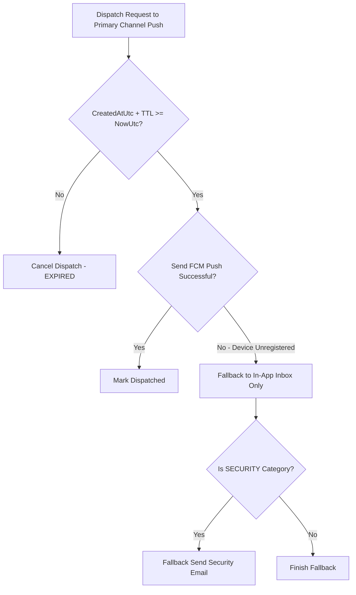

# Chốt hết hạn và fallback kênh M10

| Thuộc tính | Giá trị |
|---|---|
| Contract ID | `M10-EXPIRY-CHANNEL-FALLBACK-1.0` |
| Task | M10-T024 |
| Đầu vào | M10-CHANNEL-SELECTION-MATRIX-1.0 (M10-T020), M10-NOTIFICATION-COLLAPSE-REPLACE-1.0 (M10-T023) |
| Phạm vi | Quy trình kiểm tra thời hạn hiệu lực của thông báo (`TTL Check`) và chuyển đổi kênh dự phòng (`Channel Fallback Workflow`) khi kênh ưu tiên chính bị từ chối hoặc hết hạn |
| Tự kiểm | B-G01 |
| Phiên bản | 1.0 — 2026-08-22 |

## 1. Mục tiêu và invariant

Tài liệu này quy định quy tắc kiểm tra thời hạn hết hiệu lực (`TTL Expiry`) và chuyển đổi kênh dự phòng (`Channel Fallback Workflow`) trong M10.

- **Cấm Gửi Thông báo sau khi Hết hiệu lực (`TTL Expiry Constraint Invariant`)**:
  - Mỗi loại thông báo BẮT BUỘC có thời hạn sống `TimeToLiveSeconds` (ví dụ: Nhắc ôn tập TTL = 6 tiếng, Cảnh báo an ninh TTL = 24 tiếng).
  - Nếu `CreatedAtUtc + TimeToLiveSeconds < NowUtc`, thông báo BẮT BUỘC bị hủy ngầm và KHÔNG ĐƯỢC PHÉP gửi sang bất kỳ kênh nào.
- **Quy trình Fallback Kênh An toàn (`Safe Channel Fallback Rule`)**:
  - Khi gửi Push Notification thất bại do Token hết hạn (`UNREGISTERED_DEVICE`), hệ thống tự động fallback sang kênh **In-App Inbox**.
  - CHỈ KHỦNG HOẢNG an ninh (`SECURITY`) mới được fallback sang kênh Email (nếu người dùng đã Opt-In Email).

## 2. Luồng Kiểm tra Hết hạn và Fallback Kênh (Expiry & Fallback Flow)

## 3. Regression Gates và Test Cases

### 3.1. Regression Gates
- `EF-G01`: 100% thông báo có `CreatedAtUtc + TTL < NowUtc` bị chặn không phát đi.
- `EF-G02`: Sự cố `UNREGISTERED_DEVICE` chuyển kênh về In-App Inbox trong 100% trường hợp.

### 3.2. Test Cases tự kiểm
| Case ID | Tình huống | Kết quả bắt buộc |
|---|---|---|
| `EF24-01` | Thông báo nhắc ôn tập bị kẹt trong queue 7 tiếng (TTL = 6 tiếng) | Worker kiểm tra hết hạn, hủy thông báo và ghi `Status = EXPIRED`. |
| `EF24-02` | FCM trả về lỗi `UNREGISTERED_DEVICE` khi gửi Push cho Learner A | Hủy Push token cũ, tạo 1 bản ghi Inbox in-app cho Learner A. |
| `EF24-03` | Kiểm thử hoàn tất luồng M10-EXPIRY-CHANNEL-FALLBACK-1.0 | Đạt 100% tiêu chí nghiệm thu |

## 4. Đối chiếu Hiện trạng và Finding

| Finding ID | Quan sát | Sai lệch | Task tiếp nhận |
|---|---|---|---|
| `M10-EF-F01` | Thêm thuộc tính `TimeToLiveSeconds` trong DTO thông báo M10 | Phục vụ kiểm tra hết hạn tự động | M10-T005 |

## 5. Tự kiểm M10-T024
- Đã hoàn thành đặc tả `M10-EXPIRY-CHANNEL-FALLBACK-1.0`.
- Chốt quy tắc TTL Expiry và fallback an toàn sang In-App Inbox / Email.
- Ghi nhận 2 Regression Gates (`EF-G01`–`EF-G02`) và 3 Test Cases (`EF24-01`–`EF24-03`).

## 6. Lịch sử
| Ngày | Phiên bản | Thay đổi | Người tự kiểm |
|---|---|---|---|
| 2026-08-22 | 1.0 | Tạo mới đặc tả chốt hết hạn và fallback kênh M10-T024 | WSA-7K2 |
