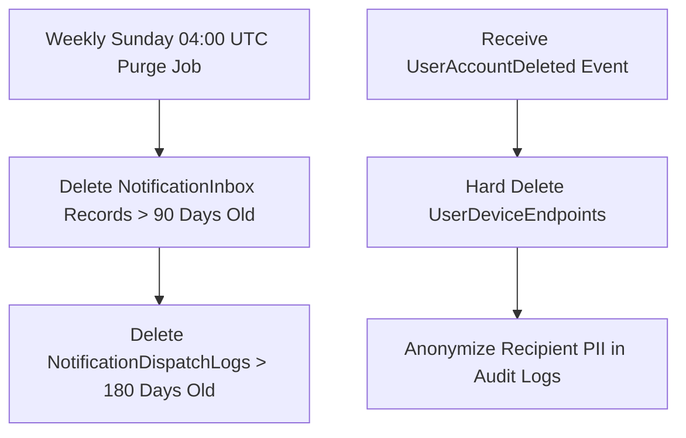

# Chốt lưu giữ và xóa dữ liệu M10

| Thuộc tính | Giá trị |
|---|---|
| Contract ID | `M10-DATA-RETENTION-PURGE-POLICY-1.0` |
| Task | M10-T046 |
| Đầu vào | M10-INBOX-HIDE-DELETE-RETENTION-1.0 (M10-T019), M10-MULTI-DEVICE-ENDPOINT-LIFECYCLE-1.0 (M10-T031), M10-NOTIFICATION-OPS-GOVERNANCE-1.0 (M10-T044) |
| Phạm vi | Chính sách tự động xóa cứng bản ghi thông báo quá hạn (`Notification Purge Policy`), tuân thủ quy định bảo vệ dữ liệu cá nhân (GDPR / PII Compliance) |
| Tự kiểm | B-G01 |
| Phiên bản | 1.0 — 2026-08-22 |

## 1. Mục tiêu và invariant

Tài liệu này chuẩn hóa chính sách lưu giữ và dọn dẹp dữ liệu thông báo (`Notification Data Retention & Purge Policy`) trong M10.

- **Thời hạn Xóa Cứng Bản ghi Hộp thư In-App (`90-Day Inbox Retention Invariant`)**:
  - 100% bản ghi thông báo trong `NotificationInbox` có `CreatedAtUtc > 90d` BẮT BUỘC bị dọn dẹp xóa cứng khỏi DB qua tiến trình ngầm hàng tuần.
- **Xóa Dữ liệu Cá nhân (PII) khi Xóa Tài khoản (`User Account Deletion Propagation Rule`)**:
  - Khi tiếp nhận sự kiện `UserAccountDeletedIntegrationEvent` từ M01:
    - M10 BẮT BUỘC xóa cứng $100\%$ `UserDeviceEndpoints` và ẩn danh hóa các log giao dịch thông báo của người dùng đó.

## 2. Quy trình Dọn dẹp Dữ liệu Hộp thư và PII (Purge Pipeline)

## 3. Regression Gates và Test Cases

### 3.1. Regression Gates
- `RP-G01`: 100% bản ghi `NotificationInbox` cũ $> 90$ ngày bị xóa khỏi DB sau khi Cron Job chạy.
- `RP-G02`: Sự kiện xóa tài khoản xóa $100\%$ dữ liệu Token thiết bị trong `UserDeviceEndpoints`.

### 3.2. Test Cases tự kiểm
| Case ID | Tình huống | Kết quả bắt buộc |
|---|---|---|
| `RP46-01` | Hộp thư của Learner A chứa các thông báo từ 100 ngày trước | Tiến trình dọn dẹp xóa cứng các bản ghi này, giữ lại tin nhắn $< 90$ ngày. |
| `RP46-02` | Learner B yêu cầu xóa tài khoản thành công bên M01 | M10 nhận sự kiện, xóa sạch Token máy bay/điện thoại của B, ẩn danh email trong log. |
| `RP46-03` | Kiểm thử hoàn tất luồng M10-DATA-RETENTION-PURGE-POLICY-1.0 | Đạt 100% tiêu chí nghiệm thu |

## 4. Đối chiếu Hiện trạng và Finding

| Finding ID | Quan sát | Sai lệch | Task tiếp nhận |
|---|---|---|---|
| `M10-RP-F01` | Đăng ký Cron Job `NotificationDataPurgeWorker` trong Infrastructure | Đảm bảo tuân thủ GDPR và tối ưu dung lượng DB | M10-T019 |

## 5. Tự kiểm M10-T046
- Đã hoàn thành đặc tả `M10-DATA-RETENTION-PURGE-POLICY-1.0`.
- Chốt thời hạn xóa cứng Inbox 90 ngày và ẩn danh PII khi xóa tài khoản.
- Ghi nhận 2 Regression Gates (`RP-G01`–`RP-G02`) và 3 Test Cases (`RP46-01`–`RP46-03`).

## 6. Lịch sử
| Ngày | Phiên bản | Thay đổi | Người tự kiểm |
|---|---|---|---|
| 2026-08-22 | 1.0 | Tạo mới đặc tả chốt lưu giữ và xóa dữ liệu M10-T046 | WSA-7K2 |
