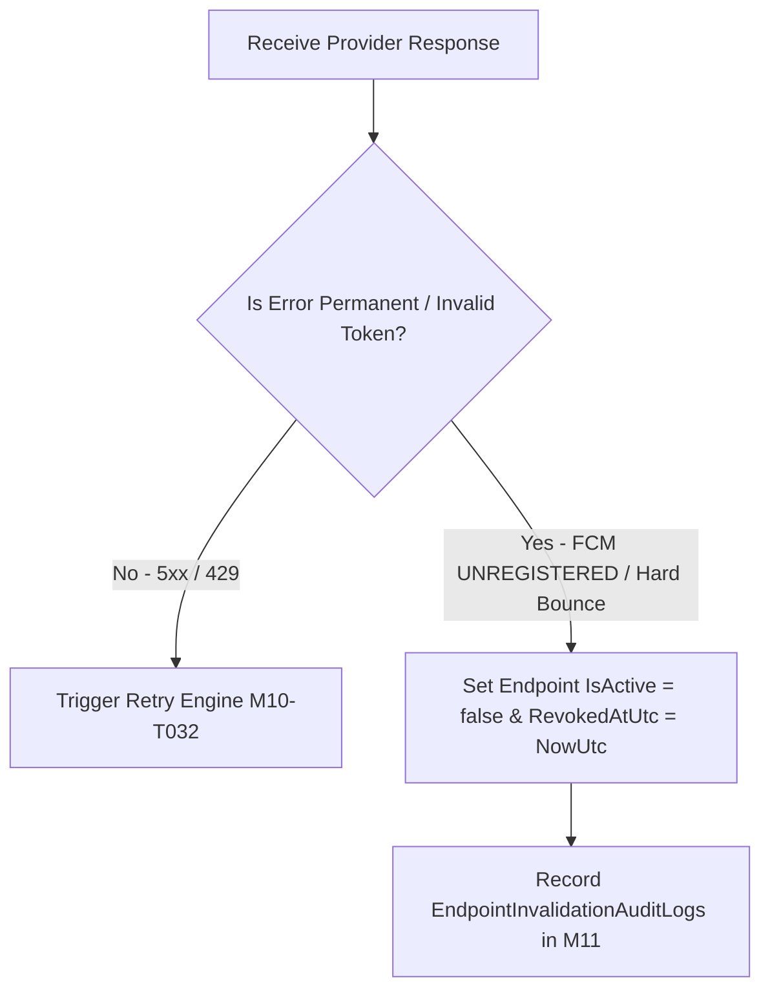

# Chốt phản hồi và vô hiệu điểm nhận M10

| Thuộc tính | Giá trị |
|---|---|
| Contract ID | `M10-ENDPOINT-INVALIDATION-RESPONSE-1.0` |
| Task | M10-T033 |
| Đầu vào | M10-MULTI-DEVICE-ENDPOINT-LIFECYCLE-1.0 (M10-T031), M10-DISPATCH-RETRY-IDEMPOTENCY-1.0 (M10-T032) |
| Phạm vi | Quy trình tiếp nhận mã lỗi từ Provider (`Provider Error Handler`) và lập tức vô hiệu hóa các Endpoint Token bị từ chối |
| Tự kiểm | B-G01 |
| Phiên bản | 1.0 — 2026-08-22 |

## 1. Mục tiêu và invariant

Tài liệu này chuẩn hóa quy trình xử lý phản hồi mã lỗi Provider và vô hiệu hóa Token thiết bị (`Provider Response Invalidation Engine`) trong M10.

- **Vô hiệu hóa Ngay lập tức khi Nhận Mã Lỗi Token Vĩnh viễn (`Immediate Invalidation Invariant`)**:
  - Khi Provider (FCM/SendGrid) trả về các mã lỗi vĩnh viễn:
    - FCM: `UNREGISTERED`, `INVALID_REGISTRATION`, `MISMATCH_SENDER_ID`.
    - SendGrid: `HARD_BOUNCE`, `SPAM_REPORT`.
  - M10 BẮT BUỘC cập nhật `IsActive = false` cho Token/Email tương ứng trong vòng $100\text{ms}$.
  - Tuyệt đối CẤM tiếp tục gửi Push/Email tới các điểm nhận đã bị đánh dấu vô hiệu.
- **Không Vô hiệu hóa nhầm cho Lỗi Tạm thời (`No Accidental Invalidation Rule`)**: Lỗi tạm thời (503 Service Unavailable, Rate Limit 429) KHÔNG ĐƯỢC PHÉP vô hiệu hóa Token thiết bị.

## 2. Quy trình Xử lý Phản hồi Vô hiệu hóa Endpoint (Invalidation Pipeline)

## 3. Regression Gates và Test Cases

### 3.1. Regression Gates
- `EI-G01`: 100% Token bị FCM phản hồi `UNREGISTERED` bị đổi `IsActive = false` trong 100ms.
- `EI-G02`: Lỗi 503 tạm thời $100\%$ không làm vô hiệu hóa Token thiết bị.

### 3.2. Test Cases tự kiểm
| Case ID | Tình huống | Kết quả bắt buộc |
|---|---|---|
| `EI33-01` | FCM trả về lỗi `UNREGISTERED` khi phát Push cho Token A | M10 cập nhật Token A `IsActive = false`, ghi nhận log lý do `UNREGISTERED`. |
| `EI33-02` | FCM trả về lỗi 503 Overloaded | Token A giữ nguyên `IsActive = true`, chuyển sang luồng retry. |
| `EI33-03` | Kiểm thử hoàn tất luồng M10-ENDPOINT-INVALIDATION-RESPONSE-1.0 | Đạt 100% tiêu chí nghiệm thu |

## 4. Đối chiếu Hiện trạng và Finding

| Finding ID | Quan sát | Sai lệch | Task tiếp nhận |
|---|---|---|---|
| `M10-EI-F01` | Áp dụng `EndpointInvalidationHandler` trong Notification Dispatch Consumer | Bảo đảm dọn dẹp Token lỗi tức thì | M10-T031 |

## 5. Tự kiểm M10-T033
- Đã hoàn thành đặc tả `M10-ENDPOINT-INVALIDATION-RESPONSE-1.0`.
- Chốt nguyên tắc vô hiệu hóa Token tức thì khi nhận lỗi 4xx/UNREGISTERED và bảo vệ Token khi lỗi 5xx.
- Ghi nhận 2 Regression Gates (`EI-G01`–`EI-G02`) và 3 Test Cases (`EI33-01`–`EI33-03`).

## 6. Lịch sử
| Ngày | Phiên bản | Thay đổi | Người tự kiểm |
|---|---|---|---|
| 2026-08-22 | 1.0 | Tạo mới đặc tả chốt phản hồi và vô hiệu điểm nhận M10-T033 | WSA-7K2 |
