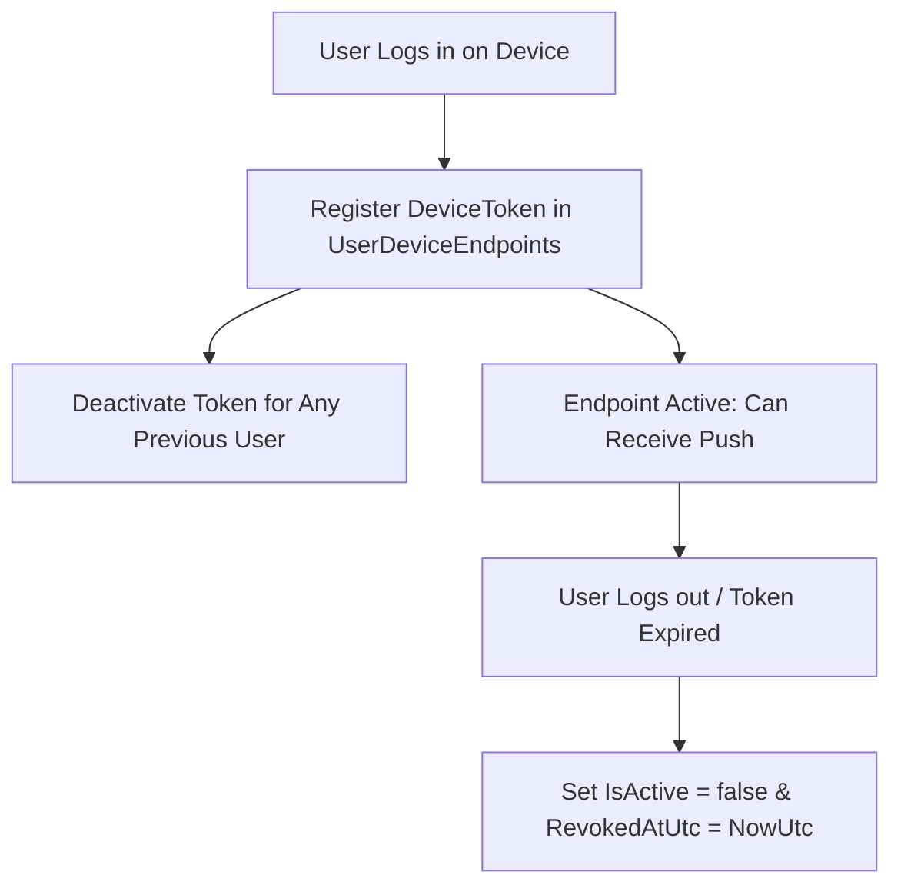

# Chốt vòng đời điểm nhận đa thiết bị M10

| Thuộc tính | Giá trị |
|---|---|
| Contract ID | `M10-MULTI-DEVICE-ENDPOINT-LIFECYCLE-1.0` |
| Task | M10-T031 |
| Đầu vào | M10-NOTIF-INBOX-DICT-1.0 (M10-T001), M10-CHANNEL-DISPATCH-STATUS-SPEC-1.0 (M10-T030), M01-AUTH-POLICY-1.0 (M01-T012) |
| Phạm vi | Quy trình quản lý vòng đời Device Push Token (`Device Endpoint Lifecycle`), đăng ký thiết bị mới, cập nhật Token và hủy Token khi đăng xuất |
| Tự kiểm | B-G01 |
| Phiên bản | 1.0 — 2026-08-22 |

## 1. Mục tiêu và invariant

Tài liệu này chuẩn hóa quy trình quản lý điểm nhận Push trên đa thiết bị (`Device Push Endpoint Lifecycle`) trong M10.

- **Vô hiệu hóa Token khi Đăng xuất / Xóa Tài khoản (`Logout Token Revocation Invariant`)**:
  - Khi người dùng bấm "Đăng xuất" hoặc gửi yêu cầu xóa tài khoản:
    - Bảng `UserDeviceEndpoints` BẮT BUỘC cập nhật `IsActive = false` và `RevokedAtUtc = NowUtc` cho DeviceToken của thiết bị đó.
    - Tuyệt đối CẤM gửi tiếp Push Notification tới Token đã bị đăng xuất.
- **Ràng buộc Duy nhất Token - Người dùng (`Single Active Owner Rule`)**:
  - Một `DeviceToken` CHỈ ĐƯỢC PHÉP gắn với duy nhất 1 `UserId` Active tại một thời điểm. Khi người dùng B đăng nhập trên thiết bị của A, Token đó BẮT BUỘC được chuyển nhượng quyền sở hữu sang B.

## 2. Quy trình Vòng đời Điểm nhận Thiết bị (Endpoint Lifecycle Flow)

## 3. Regression Gates và Test Cases

### 3.1. Regression Gates
- `EL-G01`: 100% lệnh đăng xuất vô hiệu hóa cờ `IsActive` của Token thiết bị hiện tại trong DB.
- `EL-G02`: Việc đăng nhập tài khoản mới trên cùng thiết bị chuyển nhượng $100\%$ Token sang `UserId` mới.

### 3.2. Test Cases tự kiểm
| Case ID | Tình huống | Kết quả bắt buộc |
|---|---|---|
| `EL31-01` | Learner A đăng xuất khỏi app Android | DeviceToken của máy Android đổi `IsActive = false`, M10 ngừng gửi Push tới máy này. |
| `EL31-02` | Learner B đăng nhập trên máy Android cũ của Learner A | DeviceToken đổi chủ sang Learner B, hủy liên kết với Learner A. |
| `EL31-03` | Kiểm thử hoàn tất luồng M10-MULTI-DEVICE-ENDPOINT-LIFECYCLE-1.0 | Đạt 100% tiêu chí nghiệm thu |

## 4. Đối chiếu Hiện trạng và Finding

| Finding ID | Quan sát | Sai lệch | Task tiếp nhận |
|---|---|---|---|
| `M10-EL-F01` | Lắng nghe sự kiện `UserLoggedOutIntegrationEvent` từ M01 | Tự động hủy Token thiết bị tương ứng | M01-T012 |

## 5. Tự kiểm M10-T031
- Đã hoàn thành đặc tả `M10-MULTI-DEVICE-ENDPOINT-LIFECYCLE-1.0`.
- Chốt nguyên tắc vô hiệu hóa Token khi đăng xuất và single active owner rule.
- Ghi nhận 2 Regression Gates (`EL-G01`–`EL-G02`) và 3 Test Cases (`EL31-01`–`EL31-03`).

## 6. Lịch sử
| Ngày | Phiên bản | Thay đổi | Người tự kiểm |
|---|---|---|---|
| 2026-08-22 | 1.0 | Tạo mới đặc tả chốt vòng đời điểm nhận đa thiết bị M10-T031 | WSA-7K2 |
