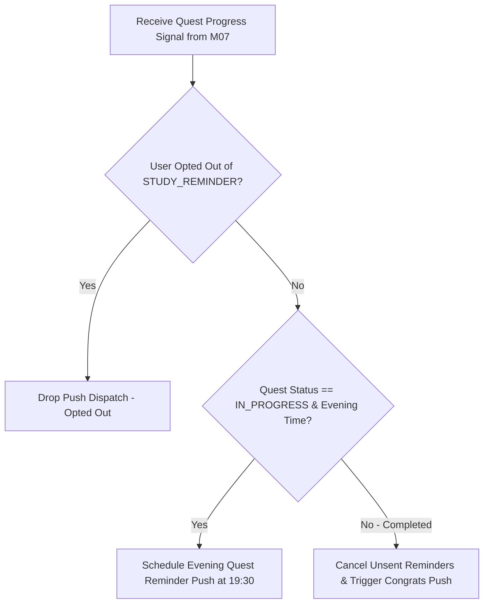

# Đặc tả nhắc nhiệm vụ và sự kiện M10

| Thuộc tính | Giá trị |
|---|---|
| Contract ID | `M10-QUEST-EVENT-REMINDER-SPEC-1.0` |
| Task | M10-T028 |
| Đầu vào | M10-NOTIFICATION-SIGNAL-CATALOG-1.0 (M10-T003), M10-NOTIFICATION-RATE-LIMITING-1.0 (M10-T022), M10-QUIET-HOURS-DEFERRAL-1.0 (M10-T026), M07-QUEST-COMPLETION-STATE-TRANSITION-1.0 (M07-T026) |
| Phạm vi | Đặc tả luồng lập lịch phát thông báo nhắc hoàn thành nhiệm vụ ngày (`Quest Reminder Pipeline`) và thông báo nhận thưởng chưa bấm |
| Tự kiểm | B-G01 |
| Phiên bản | 1.0 — 2026-08-22 |

## 1. Mục tiêu và invariant

Tài liệu này quy định luồng lập lịch và phát thông báo nhắc nhiệm vụ ngày (`Quest & Event Reminder Pipeline`) trong M10.

- **Tự động Hủy Nhắc khi Nhiệm vụ đã Hoàn thành (`Auto Recall Completed Quest Push Rule`)**:
  - Khi tiếp nhận sự kiện `QuestCompletedIntegrationEvent` từ M07:
    - M10 BẮT BUỘC hủy ngay các thông báo Push nhắc nhiệm vụ ngày đang nằm trong `DeferredPushQueue`.
    - Thay thế bằng thông báo chúc mừng hoàn thành nhiệm vụ `QUEST_COMPLETED_CONGRATS`.
- **Tôn trọng Tùy chọn Opt-Out Nhắc Nhiệm vụ (`Category Preference Enforcement`)**: Nếu người học tắt nhận tin nhóm `STUDY_REMINDER` trong `UserNotificationPreferences`, M10 BẮT BUỘC từ chối phát Push Notification nhắc nhiệm vụ.

## 2. Luồng Lập lịch và Phát Thông báo Nhắc Nhiệm vụ (Quest Reminder Pipeline)

## 3. Regression Gates và Test Cases

### 3.1. Regression Gates
- `QR-G01`: 100% request nhắc nhiệm vụ ngày bị chặn nếu người dùng Opt-Out nhóm `STUDY_REMINDER`.
- `QR-G02`: Sự kiện hoàn thành nhiệm vụ từ M07 hủy $100\%$ Push nhắc nhở cũ chưa gửi.

### 3.2. Test Cases tự kiểm
| Case ID | Tình huống | Kết quả bắt buộc |
|---|---|---|
| `QR28-01` | Learner A có 1 nhiệm vụ chưa xong lúc 19:00, không Opt-Out | M10 gửi 1 Push nhắc nhở lúc 19:30: "Bạn còn 1 nhiệm vụ ngày chưa hoàn thành!". |
| `QR28-02` | Learner A hoàn thành nhiệm vụ lúc 19:15 | M10 hủy Push lúc 19:30, phát 1 Push chúc mừng hoàn thành. |
| `QR28-03` | Kiểm thử hoàn tất luồng M10-QUEST-EVENT-REMINDER-SPEC-1.0 | Đạt 100% tiêu chí nghiệm thu |

## 4. Đối chiếu Hiện trạng và Finding

| Finding ID | Quan sát | Sai lệch | Task tiếp nhận |
|---|---|---|---|
| `M10-QR-F01` | Lắng nghe `QuestCompletedIntegrationEvent` từ M07 | Kích hoạt luồng hủy nhắc và chúc mừng | M07-T026 |

## 5. Tự kiểm M10-T028
- Đã hoàn thành đặc tả `M10-QUEST-EVENT-REMINDER-SPEC-1.0`.
- Chốt nguyên tắc hủy nhắc khi hoàn thành và tôn trọng Opt-Out nhóm STUDY_REMINDER.
- Ghi nhận 2 Regression Gates (`QR-G01`–`QR-G02`) và 3 Test Cases (`QR28-01`–`QR28-03`).

## 6. Lịch sử
| Ngày | Phiên bản | Thay đổi | Người tự kiểm |
|---|---|---|---|
| 2026-08-22 | 1.0 | Tạo mới đặc tả đặc tả nhắc nhiệm vụ và sự kiện M10-T028 | WSA-7K2 |
