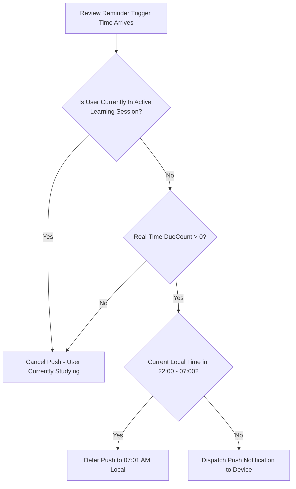

# Đặc tả nhắc ôn tập M10

| Thuộc tính | Giá trị |
|---|---|
| Contract ID | `M10-REVIEW-REMINDER-SPEC-1.0` |
| Task | M10-T027 |
| Đầu vào | M04-REVIEW-REMINDER-HANDOFF-M10-1.0 (M04-T037), M10-NOTIFICATION-RATE-LIMITING-1.0 (M10-T022), M10-QUIET-HOURS-DEFERRAL-1.0 (M10-T026) |
| Phạm vi | Đặc tả chi tiết luồng lập lịch và phát thông báo nhắc ôn tập (`Review Reminder Pipeline`), kiểm tra thời thực trước khi gửi và lùi giờ yên lặng |
| Tự kiểm | B-G01 |
| Phiên bản | 1.0 — 2026-08-22 |

## 1. Mục tiêu và invariant

Tài liệu này chuẩn hóa quy trình lập lịch và gửi thông báo nhắc ôn tập (`Review Reminder Pipeline`) trong M10.

- **Tái kiểm tra Thời thực trước khi Bấm Rung Điện thoại (`Real-Time Re-Check Invariant`)**:
  - Ngay trước khi phát lệnh Push Notification nhắc ôn tập tới FCM:
    - M10 BẮT BUỘC thực hiện kiểm tra thời thực với M04 (qua Redis Cache `active_due_count_{userId}`).
    - Nếu `DueItemCount == 0` (người dùng vừa học xong) hoặc người dùng đang mở ứng dụng làm bài (`IsUserActiveInSession == true`), M10 BẮT BUỘC hủy lượt gửi Push này.
- **Tôn trọng Giờ Yên lặng và Khớp Múi giờ (`Quiet Hours Respect Rule`)**:
  - Nếu thời điểm nhắc ôn trùng khung giờ yên lặng ($22:00 - 07:00$ local), Push Notification BẮT BUỘC hoãn đến $07:01$ sáng hôm sau mới được phát.

## 2. Quy trình Lập lịch và Gửi Nhắc Ôn tập (Review Reminder Pipeline)

## 3. Regression Gates và Test Cases

### 3.1. Regression Gates
- `RR-G01`: 100% nhắc ôn tập kiểm tra `DueCount > 0` thời thực trước khi rung điện thoại.
- `RR-G02`: Không có bất kỳ thông báo nhắc ôn Push nào được phát trong khung giờ yên lặng $22:00 - 07:00$.

### 3.2. Test Cases tự kiểm
| Case ID | Tình huống | Kết quả bắt buộc |
|---|---|---|
| `RR27-01` | Đến 20:00 giờ local, M10 định gửi Push nhắc ôn, kiểm tra thấy `DueCount = 0` | M10 hủy Push, không làm phiền người dùng. |
| `RR27-02` | M10 tính toán thời điểm nhắc ôn trùng 23:00 đêm | M10 đưa Push vào `DeferredPushQueue`, đến 07:01 sáng hôm sau mới phát. |
| `RR27-03` | Kiểm thử hoàn tất luồng M10-REVIEW-REMINDER-SPEC-1.0 | Đạt 100% tiêu chí nghiệm thu |

## 4. Đối chiếu Hiện trạng và Finding

| Finding ID | Quan sát | Sai lệch | Task tiếp nhận |
|---|---|---|---|
| `M10-RR-F01` | Sử dụng Redis Key `user_active_session_{userId}` từ M03 | Nhận biết người dùng đang trong phiên học để hoãn nhắc ôn | M03-T011 |

## 5. Tự kiểm M10-T027
- Đã hoàn thành đặc tả `M10-REVIEW-REMINDER-SPEC-1.0`.
- Chốt tái kiểm tra thời thực `DueCount > 0` và dời lịch giờ yên lặng $22:00 - 07:00$.
- Ghi nhận 2 Regression Gates (`RR-G01`–`RR-G02`) và 3 Test Cases (`RR27-01`–`RR27-03`).

## 6. Lịch sử
| Ngày | Phiên bản | Thay đổi | Người tự kiểm |
|---|---|---|---|
| 2026-08-22 | 1.0 | Tạo mới đặc tả đặc tả nhắc ôn tập M10-T027 | WSA-7K2 |
