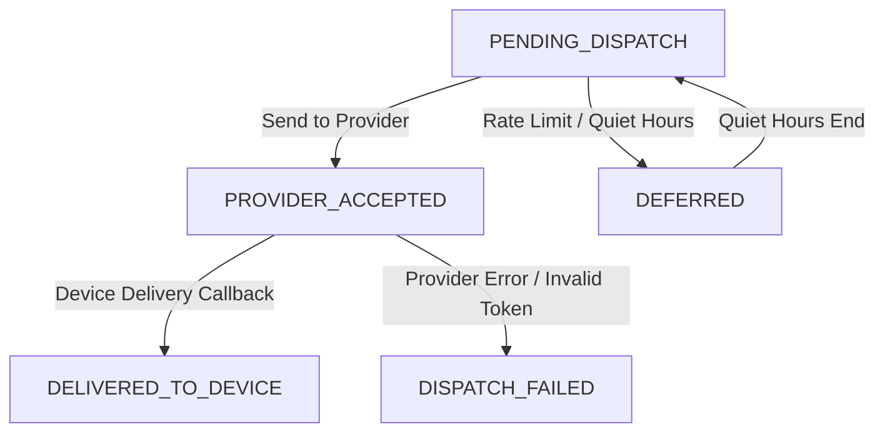

# Đặc tả trạng thái lần gửi theo kênh M10

| Thuộc tính | Giá trị |
|---|---|
| Contract ID | `M10-CHANNEL-DISPATCH-STATUS-SPEC-1.0` |
| Task | M10-T030 |
| Đầu vào | M10-CHANNEL-SELECTION-MATRIX-1.0 (M10-T020), M10-EXPIRY-CHANNEL-FALLBACK-1.0 (M10-T024) |
| Phạm vi | Máy trạng thái vòng đời lần gửi thông báo (`Notification Dispatch Lifetime State Machine`), phân biệt giữa trạng thái "Đã chuyển cho Provider" và "Thiết bị đã nhận" |
| Tự kiểm | B-G01 |
| Phiên bản | 1.0 — 2026-08-22 |

## 1. Mục tiêu và invariant

Tài liệu này chuẩn hóa máy trạng thái chuyển đổi lần gửi thông báo theo từng kênh (`Channel Dispatch Status State Machine`) trong M10.

- **Phân biệt Rõ ràng "Provider Accepted" và "Device Delivered" (`Status Distinction Invariant`)**:
  - Máy trạng thái BẮT BUỘC phân biệt 2 mốc riêng biệt:
    1. `PROVIDER_ACCEPTED`: FCM / SendGrid tiếp nhận request thành công.
    2. `DELIVERED_TO_DEVICE`: Đã nhận callback phản hồi thiết bị nhận được Push thành công.
  - Tuyệt đối CẤM đánh dấu `DELIVERED` ngay khi mới gọi xong API của Provider.
- **Lưu trữ Lý do Thất bại Chi tiết (`Detailed Failure Reason Rule`)**: 100% lần gửi thất bại BẮT BUỘC lưu `ProviderErrorCode` (ví dụ `INVALID_REGISTRATION_TOKEN`, `QUOTA_EXCEEDED`).

## 2. Máy Trạng thái Vòng đời Lần gửi Kênh (Dispatch Status Machine)

## 3. Regression Gates và Test Cases

### 3.1. Regression Gates
- `DS-G01`: 100% lần gửi qua FCM chuyển trạng thái `PROVIDER_ACCEPTED` trước khi nhận callback `DELIVERED`.
- `DS-G02`: Lần gửi thất bại lưu đầy đủ `ProviderErrorCode` vào bảng `NotificationDispatchLogs`.

### 3.2. Test Cases tự kiểm
| Case ID | Tình huống | Kết quả bắt buộc |
|---|---|---|
| `DS30-01` | Server gửi 1 Push qua FCM thành công | Trạng thái ghi nhận `PROVIDER_ACCEPTED`. Sau 2s nhận callback FCM đổi trạng thái `DELIVERED_TO_DEVICE`. |
| `DS30-02` | FCM trả về lỗi HTTP 400 `INVALID_ARGUMENT` | Trạng thái đổi `DISPATCH_FAILED`, `ProviderErrorCode = "INVALID_ARGUMENT"`. |
| `DS30-03` | Kiểm thử hoàn tất luồng M10-CHANNEL-DISPATCH-STATUS-SPEC-1.0 | Đạt 100% tiêu chí nghiệm thu |

## 4. Đối chiếu Hiện trạng và Finding

| Finding ID | Quan sát | Sai lệch | Task tiếp nhận |
|---|---|---|---|
| `M10-DS-F01` | Tạo thực thể `NotificationDispatchLog` lưu chi tiết từng lượt dispatch | Cung cấp dữ liệu đối soát đa kênh cho M11 | M10-T020 |

## 5. Tự kiểm M10-T030
- Đã hoàn thành đặc tả `M10-CHANNEL-DISPATCH-STATUS-SPEC-1.0`.
- Chốt máy trạng thái phân biệt Provider Accepted vs Device Delivered.
- Ghi nhận 2 Regression Gates (`DS-G01`–`DS-G02`) và 3 Test Cases (`DS30-01`–`DS30-03`).

## 6. Lịch sử
| Ngày | Phiên bản | Thay đổi | Người tự kiểm |
|---|---|---|---|
| 2026-08-22 | 1.0 | Tạo mới đặc tả đặc tả trạng thái lần gửi theo kênh M10-T030 | WSA-7K2 |
