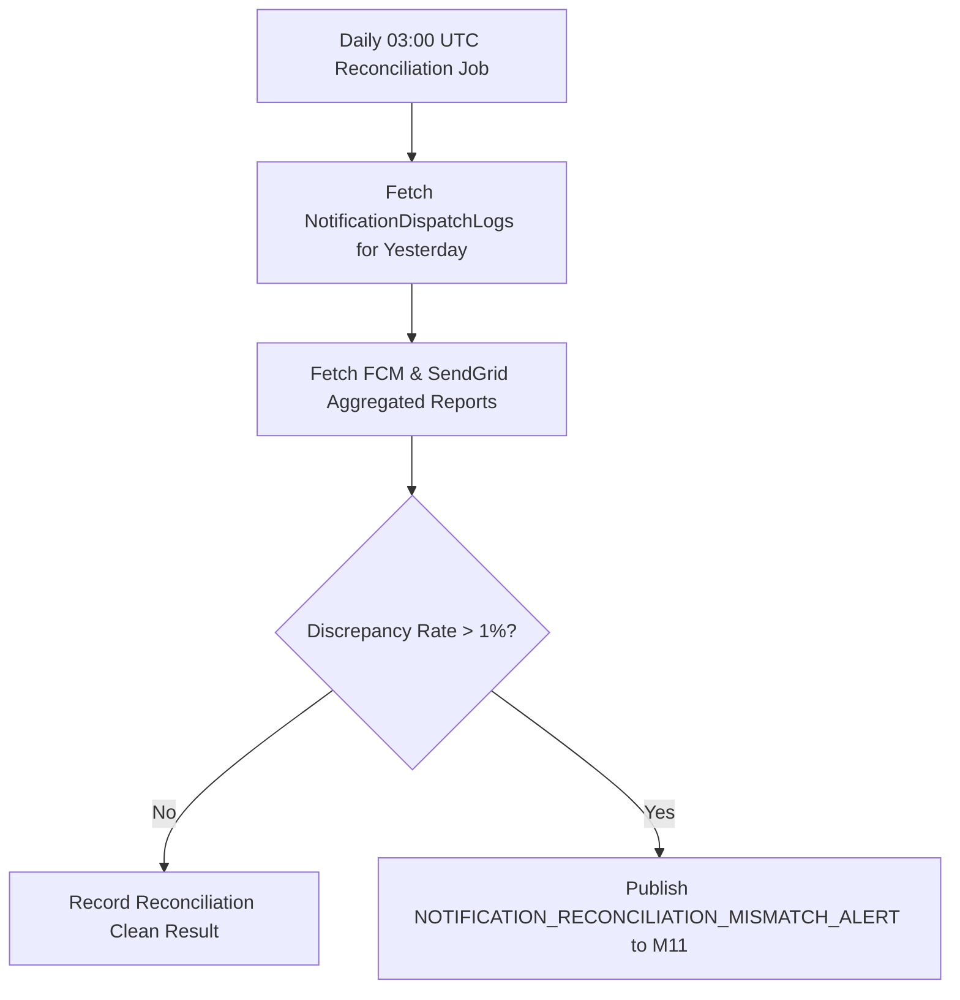

# Thiết kế đối soát đa kênh M10

| Thuộc tính | Giá trị |
|---|---|
| Contract ID | `M10-MULTI-CHANNEL-RECONCILIATION-1.0` |
| Task | M10-T034 |
| Đầu vào | M10-CHANNEL-DISPATCH-STATUS-SPEC-1.0 (M10-T030), M10-ENDPOINT-INVALIDATION-RESPONSE-1.0 (M10-T033) |
| Phạm vi | Quy trình ngầm đối soát lượng tin phát đi (`Notification Multi-Channel Reconciliation Engine`), so sánh giữa số bản ghi gửi trong DB và báo cáo đối soát từ Provider FCM/SendGrid |
| Tự kiểm | B-G01 |
| Phiên bản | 1.0 — 2026-08-22 |

## 1. Mục tiêu và invariant

Tài liệu này chuẩn hóa quy trình đối soát dữ liệu gửi thông báo đa kênh (`Multi-Channel Reconciliation Engine`) trong M10.

- **Định luật Bảo toàn Số lượng Lần gửi Thông báo (`Dispatch Accounting Invariant`)**:
  - Đối với từng kênh truyền dẫn (Push Notification, Email):
    $$\text{TotalDispatched} = \text{Delivered} + \text{Failed} + \text{Pending} + \text{Deferred}$$
  - Tổng số bản ghi dispatch trong DB M10 BẮT BUỘC khớp $100\%$ với kết quả phân loại trạng thái.
- **Không Đếm trùng Báo cáo Thống kê (`No Double Counting Stat Rule`)**:
  - Một thông báo ghi đè qua `CollapseKey` trên khay thiết bị CHỈ ĐƯỢC ĐẾM LÀ 1 BẢN HỘP THƯ INBOX duy nhất trong thống kê đọc tin của người dùng.

## 2. Quy trình Đối soát Đa kênh Hàng ngày (Daily Reconciliation Pipeline)

## 3. Regression Gates và Test Cases

### 3.1. Regression Gates
- `MR-G01`: 100% kết quả báo cáo đối soát đa kênh thỏa mãn công thức bảo toàn số lượng lần gửi.
- `MR-G02`: Tỷ lệ lệch số liệu giữa DB M10 và Provider report $> 1.0\%$ bắn cảnh báo sang M11.

### 3.2. Test Cases tự kiểm
| Case ID | Tình huống | Kết quả bắt buộc |
|---|---|---|
| `MR34-01` | M10 gửi 10,000 Push trong ngày: 9,500 Delivered, 400 Failed, 100 Deferred | Báo cáo đối soát chốt `TotalDispatched = 10,000` (Khớp 100%). |
| `MR34-02` | SendGrid ghi nhận 1,000 mail gửi nhưng DB M10 chỉ ghi 900 mail (lệch 10%) | Cron job phát cảnh báo `NOTIFICATION_RECONCILIATION_MISMATCH_ALERT`. |
| `MR34-03` | Kiểm thử hoàn tất luồng M10-MULTI-CHANNEL-RECONCILIATION-1.0 | Đạt 100% tiêu chí nghiệm thu |

## 4. Đối chiếu Hiện trạng và Finding

| Finding ID | Quan sát | Sai lệch | Task tiếp nhận |
|---|---|---|---|
| `M10-MR-F01` | Tạo `NotificationReconciliationWorker` chạy 03:00 UTC hàng ngày | Đối soát dữ liệu phát thông báo đa kênh | M10-T030 |

## 5. Tự kiểm M10-T034
- Đã hoàn thành đặc tả `M10-MULTI-CHANNEL-RECONCILIATION-1.0`.
- Chốt công thức bảo toàn số lượng dispatch và cảnh báo khi chênh lệch $> 1\%$.
- Ghi nhận 2 Regression Gates (`MR-G01`–`MR-G02`) và 3 Test Cases (`MR34-01`–`MR34-03`).

## 6. Lịch sử
| Ngày | Phiên bản | Thay đổi | Người tự kiểm |
|---|---|---|---|
| 2026-08-22 | 1.0 | Tạo mới đặc tả thiết kế đối soát đa kênh M10-T034 | WSA-7K2 |
