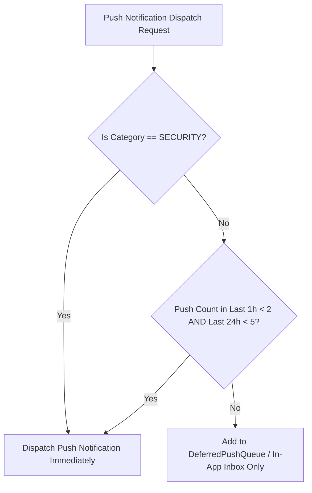

# Thiết kế giới hạn tần suất M10

| Thuộc tính | Giá trị |
|---|---|
| Contract ID | `M10-NOTIFICATION-RATE-LIMITING-1.0` |
| Task | M10-T022 |
| Đầu vào | M10-NOTIFICATION-TAXONOMY-1.0 (M10-T002), M10-CHANNEL-SELECTION-MATRIX-1.0 (M10-T020) |
| Phạm vi | Thuật toán kiểm soát giới hạn tần suất gửi Push Notification (`Notification Rate Limiter Engine`), cửa sổ thời gian (Sliding Window) chống gây phiền/mệt mỏi cho người học |
| Tự kiểm | B-G01 |
| Phiên bản | 1.0 — 2026-08-22 |

## 1. Mục tiêu và invariant

Tài liệu này chuẩn hóa thuật toán và chính sách giới hạn tần suất gửi thông báo Push Notification (`Notification Rate Limiting Engine`) trong M10.

- **Ngưỡng Giới hạn Tần suất Push Notification (`Push Rate Limit Invariant`)**:
  - Mỗi tài khoản người dùng BẮT BUỘC kẹp trần tối đa số lượng thông báo Push Notification gửi tới điện thoại trong các cửa sổ thời gian:
    - **Tối đa 2 Push / giờ** (`MaxPushPerHour = 2`).
    - **Tối đa 5 Push / ngày** (`MaxPushPerDay = 5`).
  - Mọi thông báo học tập vượt trần BẮT BUỘC bị đẩy vào hàng đợi dời lịch `DeferredPushQueue` hoặc chỉ lưu trong Inbox in-app.
- **Ngoại lệ Cảnh báo An ninh Bắt buộc (`Security Notification Exemption Rule`)**:
  - Thông báo thuộc nhóm `SECURITY` (như đăng nhập thiết bị lạ, đổi mật khẩu) ĐƯỢC MIỄN TRỪ $100\%$ khỏi giới hạn tần suất.

## 2. Luồng Kiểm tra Giới hạn Tần suất (Rate Limiting Workflow)

## 3. Regression Gates và Test Cases

### 3.1. Regression Gates
- `RL-G01`: 100% thông báo Push vượt quá 2 tin/giờ hoặc 5 tin/ngày bị hoãn hoặc chỉ lưu Inbox.
- `RL-G02`: Thông báo `SECURITY` luôn được gửi ngay lập tức dù người dùng đã nhận đủ 5 tin/ngày.

### 3.2. Test Cases tự kiểm
| Case ID | Tình huống | Kết quả bắt buộc |
|---|---|---|
| `RL22-01` | Learner nhận 2 Push nhắc học tập từ 14:00 đến 14:30, lúc 14:45 phát sinh 1 Push khen thưởng | Push thứ 3 bị hoãn sang `DeferredPushQueue`, không rung điện thoại. |
| `RL22-02` | Learner đã nhận 5 Push trong ngày, lúc 20:00 phát sinh cảnh báo đăng nhập lạ | Cảnh báo an ninh được gửi ngay lập tức tới thiết bị. |
| `RL22-03` | Kiểm thử hoàn tất luồng M10-NOTIFICATION-RATE-LIMITING-1.0 | Đạt 100% tiêu chí nghiệm thu |

## 4. Đối chiếu Hiện trạng và Finding

| Finding ID | Quan sát | Sai lệch | Task tiếp nhận |
|---|---|---|---|
| `M10-RL-F01` | Đưa Redis Sliding Window Key `push_rate_{userId}` để đếm tần suất | Đáp ứng thời gian phản hồi $< 10\text{ms}$ khi kiểm tra rate limit | M10-T020 |

## 5. Tự kiểm M10-T022
- Đã hoàn thành đặc tả `M10-NOTIFICATION-RATE-LIMITING-1.0`.
- Chốt trần 2 Push/giờ và 5 Push/ngày + ngoại lệ miễn trừ cho thông báo SECURITY.
- Ghi nhận 2 Regression Gates (`RL-G01`–`RL-G02`) và 3 Test Cases (`RL22-01`–`RL22-03`).

## 6. Lịch sử
| Ngày | Phiên bản | Thay đổi | Người tự kiểm |
|---|---|---|---|
| 2026-08-22 | 1.0 | Tạo mới đặc tả thiết kế giới hạn tần suất M10-T022 | WSA-7K2 |
