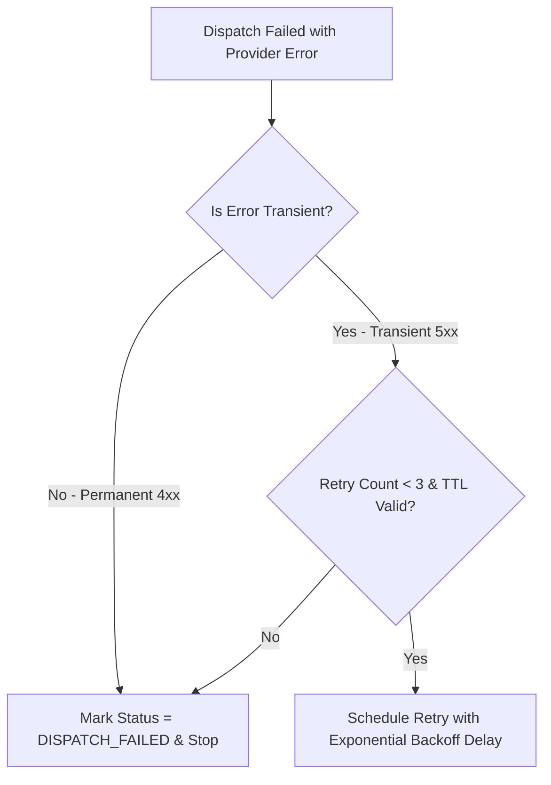

# Thiết kế thử lại và chống gửi trùng M10

| Thuộc tính | Giá trị |
|---|---|
| Contract ID | `M10-DISPATCH-RETRY-IDEMPOTENCY-1.0` |
| Task | M10-T032 |
| Đầu vào | M10-DUPLICATE-DISPATCH-LOCK-1.0 (M10-T021), M10-CHANNEL-DISPATCH-STATUS-SPEC-1.0 (M10-T030) |
| Phạm vi | Chiến lược thử lại có lùi thời gian lũy thừa (`Exponential Backoff Retry Strategy`) cho các lỗi tạm thời (Transient Errors) và bảo đảm tính idempodent khi phát Push |
| Tự kiểm | B-G01 |
| Phiên bản | 1.0 — 2026-08-22 |

## 1. Mục tiêu và invariant

Tài liệu này chuẩn hóa cơ chế thử lại và chống gửi trùng (`Dispatch Retry & Idempotency Engine`) trong M10.

- **Chiến lược Thử lại Lũy thừa cho Lỗi Tạm thời (`Transient Retry Invariant`)**:
  - Chỉ các lỗi tạm thời (ví dụ: HTTP 503 Service Unavailable, Network Timeout) MỚI ĐƯỢC THỬ LẠI.
  - Tối đa $3$ lần thử lại với khoảng chờ lùi lũy thừa: Lần 1 = $+30\text{s}$, Lần 2 = $+2\text{m}$, Lần 3 = $+10\text{m}$.
  - Các lỗi vĩnh viễn (HTTP 400, Invalid Token) BẮT BUỘC dừng thử lại lập tức và đánh dấu `DISPATCH_FAILED`.
- **Giữ nguyên IdempotencyKey qua các Lần Thử lại (`Preserved Idempotency Rule`)**: Tất cả các lượt retry BẮT BUỘC dùng lại cùng một mã `IdempotencyKey` ban đầu để tránh tạo thông báo trùng trên Provider.

## 2. Quy trình Thử lại và Chống Gửi trùng (Retry Engine Pipeline)

## 3. Regression Gates và Test Cases

### 3.1. Regression Gates
- `DR-G01`: 100% lỗi tạm thời HTTP 503 được thử lại tối đa 3 lần theo khoảng chờ lùi lũy thừa.
- `DR-G02`: Lỗi vĩnh viễn (Invalid Token) dừng thử lại ngay trong $100\%$ trường hợp.

### 3.2. Test Cases tự kiểm
| Case ID | Tình huống | Kết quả bắt buộc |
|---|---|---|
| `DR32-01` | FCM trả về HTTP 503 do quá tải server | M10 lên lịch thử lại lần 1 sau 30 giây với cùng `IdempotencyKey`. |
| `DR32-02` | Sau 3 lần thử lại FCM vẫn lỗi 503 | M10 dừng thử lại, ghi nhận `Status = DISPATCH_FAILED`, `FailureReason = MAX_RETRIES_EXCEEDED`. |
| `DR32-03` | Kiểm thử hoàn tất luồng M10-DISPATCH-RETRY-IDEMPOTENCY-1.0 | Đạt 100% tiêu chí nghiệm thu |

## 4. Đối chiếu Hiện trạng và Finding

| Finding ID | Quan sát | Sai lệch | Task tiếp nhận |
|---|---|---|---|
| `M10-DR-F01` | Sử dụng Polly Resilience Pipeline cho Retry Engine | Phục vụ tự động lùi lũy thừa và Circuit Breaker | M10-T021 |

## 5. Tự kiểm M10-T032
- Đã hoàn thành đặc tả `M10-DISPATCH-RETRY-IDEMPOTENCY-1.0`.
- Chốt trần 3 lần retry lũy thừa cho lỗi tạm thời và giữ nguyên IdempotencyKey.
- Ghi nhận 2 Regression Gates (`DR-G01`–`DR-G02`) và 3 Test Cases (`DR32-01`–`DR32-03`).

## 6. Lịch sử
| Ngày | Phiên bản | Thay đổi | Người tự kiểm |
|---|---|---|---|
| 2026-08-22 | 1.0 | Tạo mới đặc tả thiết kế thử lại và chống gửi trùng M10-T032 | WSA-7K2 |
